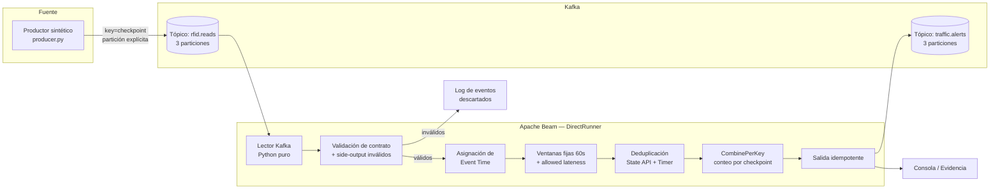

# Documento Técnico — RFID Marathon Traffic Monitor

**Curso:** Streaming de datos y sus aplicaciones — Maestría en Inteligencia Artificial, FPUNA
**Docente:** Rodrigo Parra, M.Sc.
**Equipo:** Víctor Mendoza, Luis Ríos

---

## 1. Problema y usuarios del resultado

Durante una maratón masiva (ej. Maratón Internacional de Asunción), los puntos de control (checkpoints) registran el paso de cada corredor mediante lectura de chips RFID. En eventos al aire libre, la conectividad de red es inestable: los lectores reenvían lecturas ante dudas de entrega (generando duplicados) y algunos paquetes llegan fuera de orden o con retraso respecto al momento real del evento.

El resultado de este pipeline —conteo de corredores por checkpoint en ventanas de tiempo fijas— está pensado para el **equipo de organización de la carrera**, que necesita monitorear en tiempo real la congestión en cada punto (KM-10, KM-21, META) para decisiones operativas (refuerzo de personal, hidratación, corte de calles), sin que duplicados de red ni retrasos de conectividad distorsionen esas métricas.

## 2. Arquitectura



Cada componente corre de forma independiente y reproducible vía `docker-compose.yml` (Kafka) y scripts Python (`producer.py`, `pipeline.py`).

## 3. Contrato de eventos

Todo evento publicado en `rfid.reads` cumple el siguiente esquema JSON:

```json
{
  "schema_version": 1,
  "event_id": "uuid-v4",
  "key": "KM-10 | KM-21 | META",
  "event_time": "2026-09-26T12:00:10Z",
  "payload": { "runner_id": "RUNNER-1234" }
}
```

- **`event_id`**: UUID único por lectura, usado como clave de deduplicación.
- **`key`**: checkpoint de origen; es también la clave de partición de Kafka.
- **`event_time`**: momento real del paso del corredor (tiempo de evento), independiente del momento de procesamiento.
- **`payload`**: datos de negocio (identificador del corredor).
- **`schema_version`**: entero que permite evolución del esquema. Estrategia de versionado adoptada: **aditiva y tolerante** — un consumidor debe ignorar campos desconocidos y solo rechazar el evento si falta alguno de los 4 campos obligatorios (`event_id`, `key`, `event_time`, `payload`). Un cambio de versión mayor implicaría lógica de migración explícita en el consumidor; no fue necesario en el alcance de este proyecto.

## 4. Apache Kafka: tópicos, particiones y claves

| Tópico | Particiones | Propósito |
|---|---|---|
| `rfid.reads` | 3 | Entrada de eventos crudos |
| `traffic.alerts` | 3 | Salida de agregados por ventana |

**Justificación de 3 particiones y de `key=checkpoint`:** el dominio tiene exactamente 3 checkpoints (`KM-10`, `KM-21`, `META`), cada uno con volumen de tráfico independiente. Asignar una partición fija por checkpoint (en vez de dejar el particionado por hash de Kafka) garantiza:
- **Orden preservado dentro de cada checkpoint** — necesario porque las ventanas y la deduplicación se calculan por clave, y Beam solo garantiza orden de event time consistente si los eventos de una misma clave no se dispersan de forma desbalanceada entre particiones.
- **Paralelismo real** — cada checkpoint puede procesarse de forma independiente, evitando que el tráfico de META bloquee el de KM-10.
- Entre checkpoints distintos no se requiere orden relativo, por lo que no hay costo en fijar la asignación.

La asignación explícita de partición se realiza en el productor (`CHECKPOINT_PARTITIONS`), en lugar de depender del hash por defecto de la clave, para evitar el caso en que el hash de solo 3 valores deje una partición sin tráfico (situación observada durante el desarrollo, ver sección 8).

## 5. Semántica de entrega

- **Productor → Kafka:** `acks='all'`, `retries=3`. Esto garantiza que un mensaje confirmado por el broker no se pierda, a costa de permitir reenvíos duplicados ante fallos de red — exactamente el escenario que el pipeline está diseñado para tolerar. Semántica: **at-least-once**.
- **Kafka → Beam:** lectura con auto-commit habilitado (`enable_auto_commit=True`), también **at-least-once**: ante un reinicio del pipeline, es posible reprocesar mensajes ya leídos pero no commiteados.
- **Beam → Kafka (salida):** mismo productor con `acks='all', retries=3`.
- **Declaración explícita:** el sistema **no garantiza exactly-once end-to-end**. La corrección ante duplicados se logra mediante deduplicación explícita por `event_id` dentro de Beam (ver sección 7), no mediante una garantía transaccional de Kafka. Esto es intencional y documentado, no una limitación oculta.

## 6. Apache Beam: pipeline

Etapas del pipeline (`pipeline.py`):

1. **Lectura de Kafka**: implementada en Python puro (`kafka-python`) en lugar de `KafkaIO`/`ReadFromKafka` nativo de Beam. **Motivo documentado:** en el entorno de desarrollo (Windows), el servicio de expansión Java que usa `ReadFromKafka` bajo `--environment_type=LOOPBACK` presentó fallas de comunicación con el SDK harness — los offsets avanzaban en Kafka pero los elementos nunca llegaban al lado Python del pipeline, sin producir ninguna excepción visible. Se optó por una implementación equivalente en Python puro, usando `poll()` disparado periódicamente por `PeriodicImpulse` (evitando además que un `DoFn` con loop infinito congele el watermark del runner, otro problema encontrado durante el desarrollo).
2. **Validación del contrato** (`ParseKafkaMessage`): separa eventos válidos de inválidos mediante `TaggedOutput`. Los inválidos se registran vía `logging.warning` en una rama independiente, sin bloquear el flujo principal.
3. **Asignación de tiempo de evento** (`assign_event_time`): extrae `event_time` del dominio y lo asigna como `TimestampedValue`, desacoplando el tiempo de evento del tiempo de procesamiento.
4. **Ventanas fijas de 60 segundos** con:
   - `allowed_lateness = 120s`: un evento puede llegar hasta 180s (60+120) después del inicio de su ventana y aún ser computado.
   - `trigger = AfterWatermark(late=AfterCount(1))`: dispara el pane principal al cruzar el watermark, y un pane adicional por cada evento tardío que llegue dentro del horizonte de lateness.
   - `accumulation_mode = ACCUMULATING`: cada pane tardío contiene el conteo acumulado, no solo el incremento — necesario para que la salida (identificada por `idempotency_key`) represente siempre el total correcto de esa ventana.
5. **Deduplicación** (`DeduplicateRFID`): usa `SetStateSpec` para recordar `event_id` ya vistos y `TimerSpec` (`TimeDomain.WATERMARK`) para expirar ese estado al cierre de cada ventana. El estado está *scoped* a `(checkpoint, ventana)`, por lo que el horizonte real de deduplicación es de 60s + 120s de lateness — no indefinido.
6. **Agregación**: `CombinePerKey(sum)` sobre `(checkpoint, 1)`, priorizando el combinador incremental sobre lógica ad-hoc dentro de un `DoFn` con estado.
7. **Salida idempotente**: cada resultado incluye `idempotency_key = f"{checkpoint}|{window_start}"`, permitiendo que un sistema downstream haga upsert sin duplicar métricas ante reintentos de entrega.

## 7. Confiabilidad: duplicados, idempotencia y límites

- **Duplicados**: se detectan por `event_id` dentro de la ventana activa; el horizonte de detección es de hasta 180 segundos desde el inicio de la ventana (60s de ventana + 120s de lateness).
- **Idempotencia de salida**: la clave `checkpoint|window_start` es estable entre reintentos, permitiendo materialización tipo upsert en cualquier sink downstream.
- **Límite conocido y verificado empíricamente**: un evento cuyo retraso excede `allowed_lateness` (más de 180s desde el inicio de su ventana) es descartado silenciosamente por el runner — comportamiento estándar de Beam, no un error del pipeline. Esto se comprobó de forma directa durante las pruebas con `TestStream` (ver sección 8) al avanzar el watermark más allá de ese límite antes de inyectar el evento tardío.
- **No se garantiza exactly-once end-to-end** (ver sección 5); la corrección ante duplicados depende exclusivamente de la ventana de deduplicación descrita arriba, y no protege contra duplicados generados fuera de ese horizonte temporal.

## 8. Pruebas realizadas

| Prueba | Herramienta | Qué valida |
|---|---|---|
| Deduplicación en memoria | `TestPipeline` + `beam.Create` | Que dos eventos con el mismo `event_id` se cuenten una sola vez dentro de la misma ventana |
| Ventanas y tiempo de evento con datos tardíos | `TestStream` | Que un evento que llega después de que el watermark avanzó, pero dentro de `allowed_lateness`, se compute correctamente en un pane adicional (`total_runners` pasa de 1 a 2) |
| Límite de `allowed_lateness` (hallazgo no planificado) | `TestStream` | Al avanzar el watermark más allá de `window_end + allowed_lateness` antes de inyectar el evento tardío, el pane adicional **no aparece** — confirmando el límite real de tolerancia del sistema, documentado como comportamiento esperado |
| Demostración end-to-end | Manual (productor + pipeline + Kafka reales) | Recorrido completo fuente → Kafka → Beam → Kafka de salida, con eventos normales, duplicados y tardíos inyectados concurrentemente |

## 9. Operación y reproducibilidad

```bash
# 1. Levantar Kafka y crear tópicos con 3 particiones
docker compose up -d

# 2. Verificar tópicos (opcional)
docker exec -it proyecto_maraton-kafka-1 /opt/kafka/bin/kafka-topics.sh --describe --topic rfid.reads --bootstrap-server 127.0.0.1:9092

# 3. Instalar dependencias
pip install -r requirements.txt

# 4. Ejecutar pruebas
python test/test_pipeline.py

# 5. Demostración end-to-end (dos terminales)
python src/pipeline.py      # Terminal A — consumidor/pipeline
python src/producer.py      # Terminal B — productor sintético

# 6. Detener y limpiar
docker compose down -v
```

## 10. Límites conocidos, supuestos y mejoras posibles

- El pipeline corre sobre `DirectRunner`, adecuado para demostración y pruebas, no para un despliegue de producción con paralelismo real distribuido.
- La lectura de Kafka usa una implementación propia en Python (no `KafkaIO` nativo) por la incompatibilidad de entorno documentada en la sección 6; en un entorno Linux/producción, `KafkaIO` nativo debería funcionar sin este problema.
- No se implementó un Schema Registry; el versionado de esquema es manual y aditivo (`schema_version` como entero simple).
- Extensión posible: ejecución sobre Flink como runner distribuido, aprovechando que la lógica de ventanas/estado ya está expresada en la API estándar de Beam.
- Extensión posible: dashboard de métricas en tiempo real a partir del tópico `traffic.alerts`.

